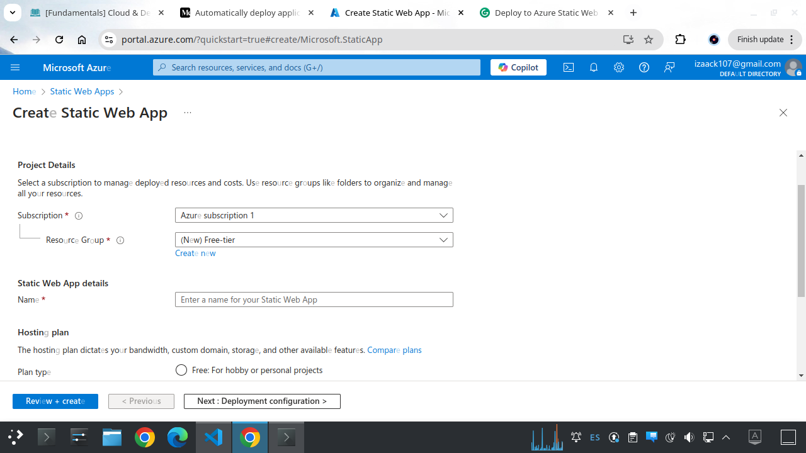
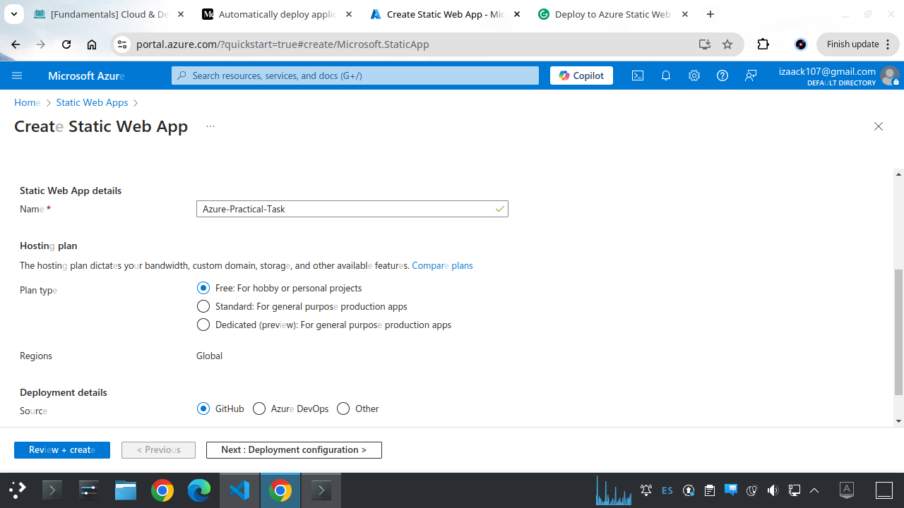
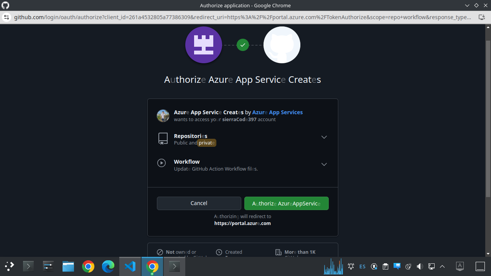
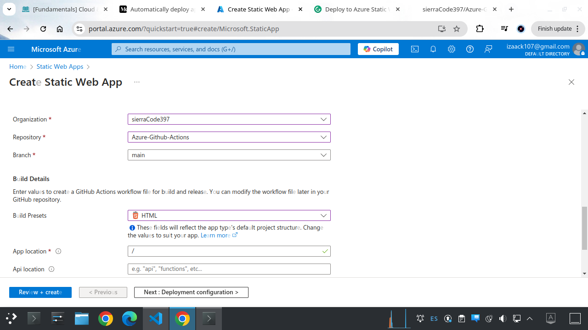
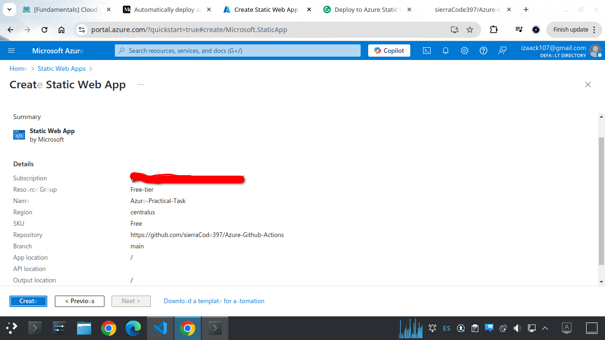
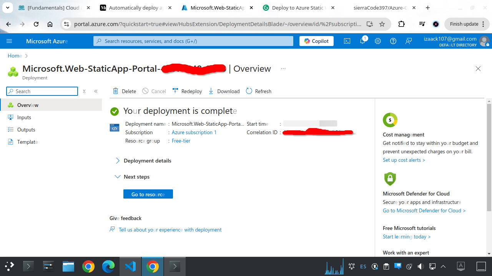
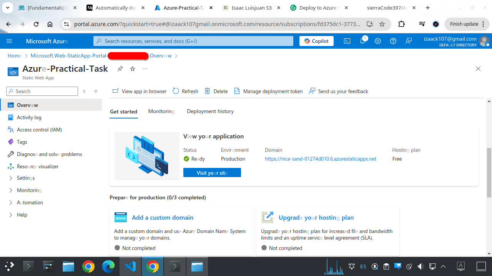
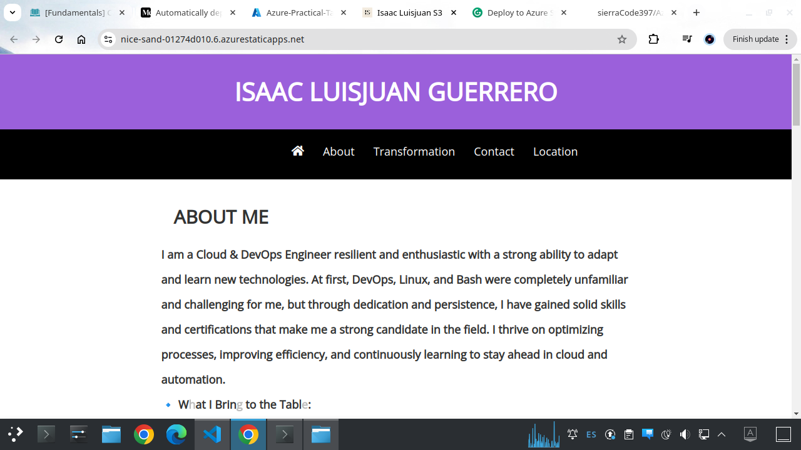
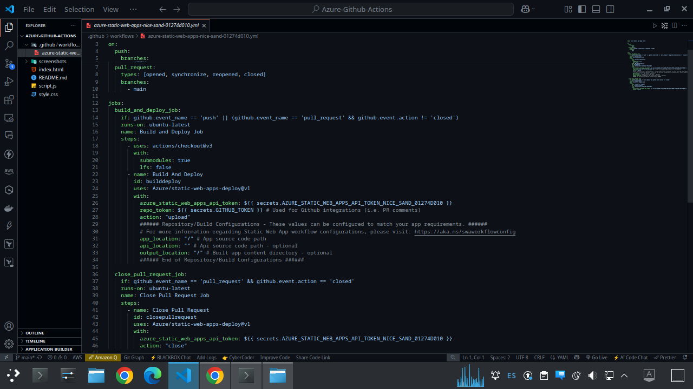
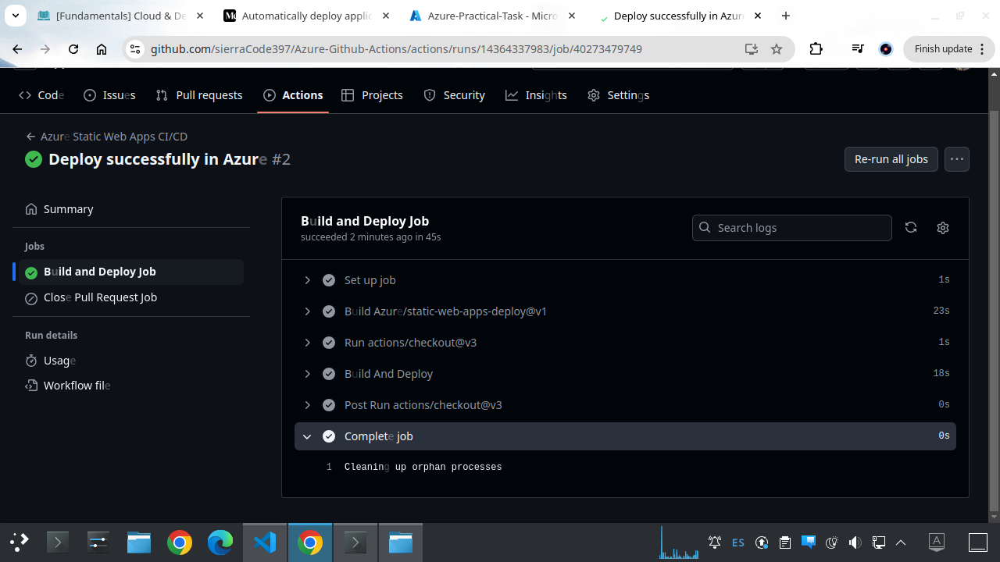

# Launch a Simple Website on Azure Static Web Apps

## 1. Setup Azure Static Web App in the Portal

### Create a New Static Web App

1. **Go to Microsoft Azure Portal**
   - Open your browser and navigate to the [Azure Portal](https://portal.azure.com).
   
2. **Select "Static Web Apps"**
   - In the portal’s left-hand menu (or using the search bar), locate and select **Static Web Apps**.

3. **Click "Create"**
   - Click on the **Create** button to start a new Static Web App project.

   

4. **Configure the Basics**
   - **Subscription:** Choose your Azure subscription.
   - **Resource Group:** Select an existing resource group or create a new one (think of it as a folder to organize your resources).
   - **Name:** Enter a unique name for your Static Web App.

5. **Set the Hosting Plan**
   - **Plan Type:** Choose **Free** (or **Standard** if additional features are required).
   - **Region:** Select the region closest to you for optimal performance.

   

---

## 2. Link Your GitHub Repository for Deployment

### Configure Deployment Details

1. **Select Deployment Source**
   - In the **Deployment details** section, choose **GitHub** as your source.
   - Click the **Sign in with GitHub** button to authenticate your GitHub account.

   

2. **Choose Repository and Branch**
   - **Organization:** Select your GitHub organization.
   - **Repository:** Choose the repository containing your website code.
   - **Branch:** Pick the branch (commonly `main`) that will trigger deployments on code changes.

3. **Specify Build Configurations**
   - **Build Presets:** Select a preset that matches your framework (e.g., Svelte, React, Vue, etc.).
   - **App Location:** Provide the path where your application is located (use the default `/` if it’s in the root directory).
   - **API Location:** Leave empty if you have no API configured now (this can be updated later).
   - **Output Location:** Set the folder where the built files are output (e.g., `public`, `build`).

   

---

## 3. Review and Create

### Finalize Your Setup

1. **Review Your Settings**
   - Double-check all your configuration settings in the preview.
  
2. **Deploy the App**
   - Click **Review and create**, then **Create** to initialize the deployment.
  
   

---

## 4. Deployment Process and Workflow

- **Automated Workflow:**  
  Underneath the surface, Azure automatically commits a GitHub Actions workflow (a YAML file) to your repository. This file controls the build and deployment process based on the settings you provided.
  
- **Customizations:**  
  If needed, you can edit the YAML file to adjust configurations like API endpoints or build directories.

  

---

## 5. Test Your Website

### Verify Your Deployment

1. **Access Your App**
   - After deployment, open your Static Web App’s overview page in the Azure Portal.

   
  
2. **Locate the URL**
   - Copy the auto-generated **URL** of your website provided by Azure.
  
3. **View Your Website**
   - Paste the URL into your browser to see your live site.

   

---

> **Remark:**  
> Underneath the hood, Azure commits the Azure Static Web App workflow file to your repository — see the latest commit in your repo.  
> This is the `.yaml` file which dictates the build and deployment process for your Static Web App.  
> You will see some configurations that you provided there, and you can update them if needed (e.g., API location).

   

> **Here is the Pipeline.**

   

---

**Finished**  
I have successfully launched a static website using **Azure Static Web Apps**.
